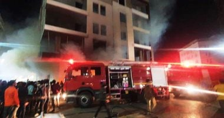
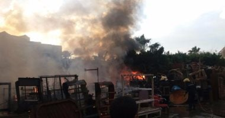

# ITI_Project
ITI Team Project
<!DOCTYPE html>
<html lang="en">

<head>
  <meta charset="utf-8">
  <meta content="width=device-width, initial-scale=1.0" name="viewport">
  <title>Home.</title>
  <meta content="" name="description">
  <meta content="" name="keywords">
  <link href="assets/img/hero-bg.jpg" rel="icon">
  <link href="assets/img/apple-touch-icon.png" rel="apple-touch-icon">
  <link
    href="https://fonts.googleapis.com/css?family=Open+Sans:300,300i,400,400i,600,600i,700,700i|Raleway:300,300i,400,400i,500,500i,600,600i,700,700i|Poppins:300,300i,400,400i,500,500i,600,600i,700,700i"
    rel="stylesheet">
  <link href="assets/vendor/animate.css/animate.min.css" rel="stylesheet">
  <link href="assets/vendor/aos/aos.css" rel="stylesheet">
  <link href="assets/vendor/bootstrap/css/bootstrap.min.css" rel="stylesheet">
  <link href="assets/vendor/bootstrap-icons/bootstrap-icons.css" rel="stylesheet">
  <link href="assets/vendor/boxicons/css/boxicons.min.css" rel="stylesheet">
  <link href="assets/vendor/glightbox/css/glightbox.min.css" rel="stylesheet">
  <link href="assets/vendor/remixicon/remixicon.css" rel="stylesheet">
  <link href="assets/vendor/swiper/swiper-bundle.min.css" rel="stylesheet">
  <link href="assets/css/style.css" rel="stylesheet">
</head>

<body>

  <!-- ======= Header ======= -->
  <header id="header" class="fixed-top d-flex align-items-center ">
    

      <h1 class="logo"><a href="index.html">Fire Station In Alexandria</a></h1>
      <nav id="navbar" class="navbar">
        <ul>
          <li><a class="nav-link scrollto " href="home.html">Home</a></li>
          <li><a class="nav-link scrollto" href="aboutUs.html">About Us</a></li>
          <li class="dropdown"><a href="#">Problems <i class="bi bi-chevron-down"></i></a>
            <ul>
              <li><a href="pro11.html">Statistical analysis</a></li>
              <li><a href="pro1.html">Network Analysis</a></li>
              
            </ul>
          </li>
          <li class="dropdown"><a href="#">Solution <i class="bi bi-chevron-down"></i></a>
            <ul>
              <li><a href="sol11.html">Statistics analysis</a></li>
              <li><a href="sol2.html">Network Analysis</a></li>
              
            </ul>
          </li>
          <li><a class="nav-link scrollto" href="locatoin.html">Location</a></li>

          <li><a class="nav-link scrollto"
              href="https://www.arcgis.com/apps/dashboards/1dfda0ec7fbd488b876185c6d543b91d">Dashboard</a></li>

          <li><a class="nav-link scrollto"
              href="https://learngis2.maps.arcgis.com/apps/webappviewer/index.html?id=42b655e67a3e429ab80d1ad74f889945">WebApp</a>
          </li>

        </ul>
        <i class="bi bi-list mobile-nav-toggle"></i>
      </nav><!-- .navbar -->

    

  </header><!-- End Header -->

  <!-- ======= Hero Section ======= -->
  <section id="hero" class="d-flex justify-cntent-center align-items-center mb-5">
    

      <!-- Slide 1 -->
      

        

          <h2 class="animate__animated animate__fadeInDown">Civil Defense</h2>
          
is an effort to protect the citizens of a state (generally
            non-combatants) from natural disasters. It uses the principles of emergency operations: prevention,
            mitigation, preparation, response, or emergency evacuation and recovery.

          <a href="#about" class="btn-get-started animate__animated animate__fadeInUp scrollto">Read More</a>
        

      

      <!-- Slide 2 -->
      

        

          <h2 class="animate__animated animate__fadeInDown">Firefighter</h2>
          
Firefighters respond to fires, accidents and other incidents
            where there are risks to life and property.

          <a href="#about" class="btn-get-started animate__animated animate__fadeInUp scrollto">Read More</a>
        

      

      <!-- Slide 3 -->
      

        

          <h2 class="animate__animated animate__fadeInDown">skills for firefighters</h2>
          
confidence ,
            resilience ,
            good communication skills
            and the ability to work well under pressure.

          <a href="#about" class="btn-get-started animate__animated animate__fadeInUp scrollto">Read More</a>
        

      

      <a class="carousel-control-prev" href="#heroCarousel" role="button" data-bs-slide="prev">
        
      </a>

      <a class="carousel-control-next" href="#heroCarousel" role="button" data-bs-slide="next">
        
      </a>

    

  </section><!-- End Hero -->

  <main id="main">

    <!-- ======= Frequently Asked Questions Section ======= -->
    <section id="faq" class="faq section-bg mt-5 mb-5">
      

        

          <h2>Fires in Alexandria</h2>
        

        

          <ul>
            <li data-aos="fade-up" data-aos-delay="100">
              <i class="bx bx-help-circle icon-help"></i> <a data-bs-toggle="collapse" class="collapse"
                data-bs-target="#faq-list-1">A fire in a residential apartment east of Alexandria <i
                  class="bx bx-chevron-down icon-show"></i><i class="bx bx-chevron-up icon-close"></i></a>
              

                
                
Ghazia El-Montazah case in Alexandria, assigning the criminal evidence to examine a fire that broke
                  out in a residential apartment, due to an electric circuit and a natural pipe explosion due to a leak
                  without injuries, and asking the affairs of the eye about the incident, and promptly requesting
                  investigations by the detectives.

                  Major General Mahmoud Abu Amra, Director of Alexandria Security, received a notification from civil
                  protection officers in Alexandria, stating that a fire broke out in a residential apartment on the
                  fourth floor on Shaimaa Street in the Religious Institute in the Asafra area, before the Montazah
                  Police Department.

              

            </li>

            <li data-aos="fade-up" data-aos-delay="200">
              <i class="bx bx-help-circle icon-help"></i> <a data-bs-toggle="collapse" data-bs-target="#faq-list-2"
                class="collapsed">Controlling a fire in a room on the highest property in the Raml Station area in the
                center of Alexandria <i class="bx bx-chevron-down icon-show"></i><i
                  class="bx bx-chevron-up icon-close"></i></a>
              

                
                
Civil Protection forces in the Alexandria Security Directorate managed to control a room on the roof
                  of a property in the Raml Station area in the city center. A report was prepared and the Public
                  Prosecution Office notified the investigations, which decided to assign criminal evidence to conduct
                  the search, and a quick request for investigation from the investigators about the incident and the
                  questioning of eyewitnesses.

                  Major General Mahmoud Abu Amra, Director of Alexandria Security, received a notification from the
                  warden of the Attarin Police Department, stating that he had received a report of a fire in a building
                  behind a restaurant branching from Al-Shuhada Street, without causing injuries or losses. life.
                

              

            </li>

            <li data-aos="fade-up" data-aos-delay="300">
              <i class="bx bx-help-circle icon-help"></i> <a data-bs-toggle="collapse" data-bs-target="#faq-list-3"
                class="collapsed">A person was injured in a fire in a food store in Dekheila in Alexandria. <i
                  class="bx bx-chevron-down icon-show"></i><i class="bx bx-chevron-up icon-close"></i></a>
              

                
                
Today, Friday, a person was injured in a fire that broke out in a food store in the Dekheila Police
                  Department in Alexandria Governorate, and he was transferred for treatment to the hospital, where the
                  Civil Protection in Alexandria received a report that a fire broke out in a food store in the Abdel
                  Moneim Jaber complex in the Hannoville area, and the investigations of the Dekheila Police Department
                  moved under the leadership of Lieutenant-Colonel Tariq. Al-Shennawi, and two civil protection cars
                  were paid.
                

              

            </li>

            <li data-aos="fade-up" data-aos-delay="400">
              <i class="bx bx-help-circle icon-help"></i> <a data-bs-toggle="collapse" data-bs-target="#faq-list-4"
                class="collapsed">A fire was brought under control in the Friday market, west of Alexandria, without
                losses <i class="bx bx-chevron-down icon-show"></i><i class="bx bx-chevron-up icon-close"></i></a>
              

                
                
Today, Monday, the Civil Defense forces in Alexandria controlled a fire in the Friday market that
                  broke out in a part of the market for the second time in a row, and the forces controlled the fire
                  without material losses.

                  The Alexandria Governorate Operations Room received a notification of a fire in the Friday Market,
                  west of Alexandria, for the second time in a row, within two weeks, without clear reasons for the
                  outbreak of the fire.
                

              

            </li>

          </ul>
        

      

    </section><!-- End Frequently Asked Questions Section -->

    

      

        <a href="#" class="twitter" style="color: azure;"><i class="bx bxl-twitter"></i></a>
        <a href="#" class="facebook" style="color: azure;"><i class="bx bxl-facebook"></i></a>
        <a href="#" class="instagram" style="color: azure;"><i class="bx bxl-instagram"></i></a>
        <a href="#" class="google-plus" style="color: azure;"><i class="bx bxl-skype"></i></a>
        <a href="#" class="linkedin" style="color: azure;"><i class="bx bxl-linkedin"></i></a>
      

      

        @teamIti.com
      

    

    <!-- Vendor JS Files -->
    
    
    
    
    
    
    

</body>

</html>
